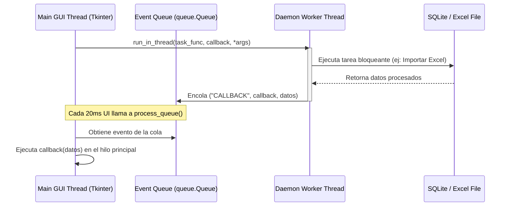

# 🏢 Arquitectura y Estructura del Sistema

El software **NEXUS ENTERPRISE** está diseñado como una aplicación de escritorio multiplataforma construida sobre **Python 3.13** y **CustomTkinter** (un wrapper moderno de Tkinter con soporte para temas oscuros/claros, bordes redondeados y tipografía estilizada).

---

## 🏗️ Flujo de Concurrencia (Multi-threading)

Dado que las interfaces gráficas (GUI) en Python corren sobre un único hilo principal (Main Thread), cualquier operación pesada (como consultas extensas a la base de datos SQL o la lectura/escritura de planillas Excel masivas con `openpyxl`) congelaría la pantalla del usuario. 

Para solucionar esto, NEXUS implementa un motor de hilos asíncronos basado en colas de eventos en `main.py`:



### Implementación del Hilo de Trabajo (Worker)
El método principal para delegar trabajo a un hilo es:
```python
def run_in_thread(self, task_func, callback=None, *args, **kwargs):
    def worker():
        try:
            result = task_func(*args, **kwargs)
            self.queue.put(("CALLBACK", callback, result))
        except Exception as e:
            self.queue.put(("ERROR", str(e), None))
    threading.Thread(target=worker, daemon=True).start()
```

---

## 📂 Organización de Archivos y Componentes

El código fuente está modularizado en la carpeta `desktop_app/`:

* **[main.py](file:///c:/Users/USUARIO/Desktop/inventario/desktop_app/main.py)**: Punto de entrada de la aplicación. Configura la ventana principal (`ctk.CTk`), el menú lateral (sidebar), la barra de búsqueda global y la orquestación del enrutamiento de páginas.
* **[database.py](file:///c:/Users/USUARIO/Desktop/inventario/desktop_app/database.py)**: Administrador de base de datos (`Database`). Contiene la definición del esquema SQLite, consultas optimizadas, logs de auditoría y la lógica de negocio de altas, traslados y bajas.
* **`components/`**: Módulos visuales aislados que heredan de `ctk.CTkFrame` o `ctk.CTkScrollableFrame`:
  * **[dashboard.py](file:///c:/Users/USUARIO/Desktop/inventario/desktop_app/components/dashboard.py)**: Panel maestro con tarjetas de KPIs contables (valor de compra, valor libro neto), alertas en tiempo real y gráficos de proyección patrimonial (depreciación a 5 años).
  * **[inventory.py](file:///c:/Users/USUARIO/Desktop/inventario/desktop_app/components/inventory.py)**: Tabla interactiva para la exploración de todos los activos, paginada de 50 en 50, con acciones de edición rápida, traslado y baja.
  * **[registry.py](file:///c:/Users/USUARIO/Desktop/inventario/desktop_app/components/registry.py)**: Ficha técnica para el ingreso manual de nuevos activos y el disparador de importación masiva de Excel.
  * **[dependencies.py](file:///c:/Users/USUARIO/Desktop/inventario/desktop_app/components/dependencies.py)**: Vista agrupada por salones de clase y áreas administrativas, con cálculo consolidado de activos y valores contables por zona.
  * **[loans.py](file:///c:/Users/USUARIO/Desktop/inventario/desktop_app/components/loans.py)**: Formulario y tabla de préstamos vigentes a profesores de la institución con sistema de detección de entregas vencidas.
  * **[settings.py](file:///c:/Users/USUARIO/Desktop/inventario/desktop_app/components/settings.py)**: Configuración institucional (Nombre de la sede, NIT, DANE, Representante legal) guardada de forma persistente.
