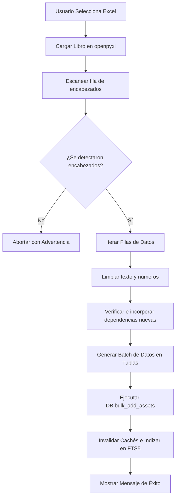

# 📂 Motor de Importación y Exportación de Datos

El sistema **NEXUS** cuenta con un motor inteligente para la ingesta masiva de planillas de inventario en formato Excel (`.xlsx`), así como rutinas de exportación formateada. Esto permite la compatibilidad con los listados provistos por el comité de inventarios de la Secretaría de Educación.

---

## 🧠 Algoritmo de Mapeo Inteligente de Columnas

Las planillas de Excel no siempre tienen el mismo orden de columnas ni los mismos encabezados exactos. Para solucionar esto, el método `run_intelligent_import` en [main.py](file:///c:/Users/USUARIO/Desktop/inventario/desktop_app/main.py) y [migrate_data.py](file:///c:/Users/USUARIO/Desktop/inventario/desktop_app/migrate_data.py) utiliza un diccionario de palabras clave (`KEYWORDS`) para mapear dinámicamente las columnas del Excel a los campos de la base de datos.

### 🔍 Palabras Clave de Detección (Muestra)
```python
KEYWORDS = {
    "code":     ["CÓDIGO ARTÍCULO", "CÓDIGO", "PLACA", "ID PATRIM"],
    "desc":     ["DESCRIPCIÓN", "DESCRIPCION", "ARTÍCULO", "NOMBRE", "DETALLE"],
    "val_uni":  ["VALOR UNITARIO INICIAL", "VALOR UNITARIO", "COSTO UNIT", "VALOR"],
    "dep":      ["DEPENDENCIA", "UBICACIÓN", "UBICACION", "AREA"],
    "func":     ["FUNCIONARIO", "RESPONSABLE"],
    "ident":    ["IDENTIFICACION", "CÉDULA", "CEDULA"],
    # ... otros campos
}
```

### ⚙️ Proceso de Mapeo
1. **Detección del Encabezado**: El importador inspecciona las primeras 20 filas buscando aquella fila donde coincidan al menos 3 encabezados estándar conocidos.
2. **Asociación de Índices**: Asocia el índice numérico de la columna de Excel con la propiedad correspondiente. Si no hay coincidencia exacta de texto, intenta una búsqueda por subcadena parcial.
3. **Mapeo por Defecto**: Si una columna no existe en el Excel importado, se le asigna un valor por defecto seguro (por ejemplo, número de serie "N/A" o sede "Guaimaral").

---

## 🧮 Limpieza de Valores Numéricos (`clean_num`)

Las planillas a menudo contienen valores numéricos con formatos inconsistentes (signos de pesos `$`, espacios en blanco, comas como miles o comas como decimales). La función de limpieza unifica estos formatos de la siguiente manera:

```python
def clean_num(v):
    if v is None: return 0.0
    if isinstance(v, (int, float)): return float(v)
    s = str(v).strip().replace('$', '').replace(' ', '')
    if not s: return 0.0
    try:
        # Detecta formato de miles/decimales en inglés vs español
        if ',' in s and '.' in s:
            if s.rfind(',') > s.rfind('.'):
                s = s.replace('.', '').replace(',', '.') # Formato Español (miles.decimal,decimal)
            else:
                s = s.replace(',', '') # Formato Inglés (miles,decimal.decimal)
        elif ',' in s:
            last_comma = s.rfind(',')
            if len(s) - last_comma - 1 == 3: s = s.replace(',', '') # Miles
            else: s = s.replace(',', '.') # Decimal
        elif '.' in s:
            last_dot = s.rfind('.')
            if len(s) - last_dot - 1 == 3: s = s.replace('.', '') # Miles
        return float(s)
    except:
        return 0.0
```

---

## 📑 Flujo de Importación Masiva



---

## 📥 Exportación Global

La exportación en [main.py](file:///c:/Users/USUARIO/Desktop/inventario/desktop_app/main.py#L382-L429) genera un archivo `.xlsx` estructurado utilizando estilos visuales profesionales (colores oscuros para cabeceras con letra blanca en negrita, celdas de datos ordenadas y formateadas).

### Formato de salida oficial de NEXUS
Las columnas del archivo exportado respetan la estructura oficial requerida por el área de control patrimonial:
1. `CODIGO`
2. `DESCRIPCION`
3. `VALOR`
4. `FECHAADQUISICION`
5. `MARCA`
6. `SERIAL`
7. `UBICACION`
8. `CODCONTABLE`
9. `VIDAUTIL`
10. `CODDEPRECIACION`
11. `DEPRECIACUMULADA`
12. `CODGASTO`
13. `FUNCIONARIO`
14. `IDENTIFICACION`
15. `CODGRUPO`
16. `CODSUBGRUPO`
17. `TIPO`
18. `EXISTENCIAINICIAL`
19. `SEDE`
