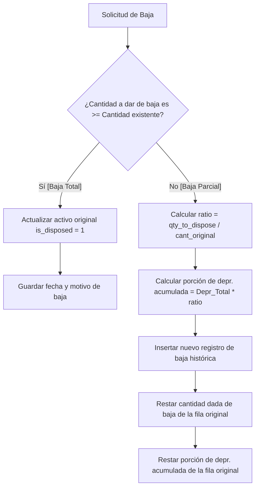

# 📉 Lógica de Bajas y Desincorporaciones Patrimoniales

El módulo de bajas de **NEXUS** permite retirar activos del balance contable activo de forma legal y trazable. El sistema implementa un algoritmo contable riguroso para dar soporte tanto a **bajas totales** como a **bajas parciales** (cuando solo una porción de un lote de bienes se daña o se retira).

---

## ⚙️ Diferenciación de Procesos de Baja

Cuando se solicita dar de baja un bien, el método `dispose_asset` en [database.py](file:///c:/Users/USUARIO/Desktop/inventario/desktop_app/database.py#L534-L583) analiza la cantidad a retirar (`qty_to_dispose`) respecto a la cantidad actual del activo (`EXISTENCIAINICIAL`):



---

## 🧮 Lógica Matemática de la Baja Parcial (Ejemplo)

Supongamos que tenemos un lote de **5 computadores** registrados en un único activo con los siguientes datos:
* **Cantidad original (`EXISTENCIAINICIAL`)**: 5
* **Valor unitario (`VALOR`)**: $1,000,000 COP
* **Valor inicial total**: $5,000,000 COP
* **Depreciación acumulada (`DEPRECIACUMULADA`)**: $1,500,000 COP
* **Valor neto en libros (Valor actual)**: $3,500,000 COP

Se solicita dar de baja **2 computadores** por daño eléctrico irreversible.

### 1. Cálculo de Ratio Contable
$$\text{Ratio} = \frac{\text{Cantidad a dar de baja}}{\text{Cantidad original}} = \frac{2}{5} = 0.4 \quad (40\%)$$

### 2. Prorrateo de la Depreciación Acumulada
Se calcula la parte de la depreciación correspondiente a los equipos dañados:
$$\text{Porción Depreciación} = \text{Depreciación Acumulada Original} \times \text{Ratio} = \$1,500,000 \times 0.4 = \$600,000 \text{ COP}$$

### 3. Registro Histórico de la Baja (Nueva Fila en DB)
Se inserta una nueva fila en `assets` con la marca de baja (`is_disposed = 1`):
* **Cantidad (`EXISTENCIAINICIAL`)**: 2
* **Valor unitario (`VALOR`)**: $1,000,000 COP
* **Valor inicial total**: $2,000,000 COP
* **Depreciación acumulada (`DEPRECIACUMULADA`)**: $600,000 COP
* **Valor actual neto**: $1,400,000 COP (Valor de adquisición de $2M menos $600k depreciación)
* **Estado de baja**: `is_disposed = 1`, fecha y motivo detallado del retiro.

### 4. Ajuste del Activo Activo Remanente (Fila Original)
Se reduce la cantidad y la depreciación acumulada de la fila original para reflejar que quedan 3 unidades en servicio:
* **Nueva cantidad (`EXISTENCIAINICIAL`)**: $5 - 2 = 3$
* **Nueva depreciación acumulada (`DEPRECIACUMULADA`)**: $\$1,500,000 - \$600,000 = \$900,000 \text{ COP}$
* **Nuevo valor inicial total**: $3 \times \$1,000,000 = \$3,000,000 \text{ COP}$
* **Nuevo valor actual neto**: $\$3,000,000 - \$900,000 = \$2,100,000 \text{ COP}$

---

## 🛠️ Código SQL del Algoritmo (Baja Parcial)

```python
# Insertar registro histórico dado de baja
sql = """
    INSERT INTO assets (
        CODIGO, DESCRIPCION, VALOR, FECHAADQUISICION, MARCA, SERIAL, UBICACION,
        CODCONTABLE, VIDAUTIL, CODDEPRECIACION, DEPRECIACUMULADA, CODGASTO, FUNCIONARIO,
        IDENTIFICACION, CODGRUPO, CODSUBGRUPO, TIPO, EXISTENCIAINICIAL, SEDE,
        is_disposed, disposal_date, disposal_reason
    ) VALUES (?,?,?,?,?,?,?,?,?,?,?,?,?,?,?,?,?,?,?,1,?,?)
"""
self.cursor.execute(sql, (
    row['CODIGO'], row['DESCRIPCION'], unit_val, row['FECHAADQUISICION'], row['MARCA'], row['SERIAL'],
    row['UBICACION'], row['CODCONTABLE'], row['VIDAUTIL'], row['CODDEPRECIACION'], depr_portion,
    row['CODGASTO'], row['FUNCIONARIO'], row['IDENTIFICACION'], row['CODGRUPO'], row['CODSUBGRUPO'],
    row['TIPO'], qty_to_dispose, row['SEDE'], date, reason
))

# Actualizar el activo original con los remanentes activos
new_qty = current_qty - qty_to_dispose
new_depr = float(row['DEPRECIACUMULADA'] or 0) - depr_portion
self.cursor.execute(
    "UPDATE assets SET EXISTENCIAINICIAL=?, DEPRECIACUMULADA=? WHERE id=?",
    (new_qty, new_depr, asset_id)
)
```
